# Mermaid Diagrams

This is a collection of the diagrams that I use for planning and understanding feature flows.

## Project Structure

-   All the diagrams live in the `/diagrams` directory located in the project root.
-   Each diagram inside the `/diagrams` directory has it's own folder and should strictly be named as `diagram.md`.
-   Following this folder structure will ensure smooth execution and results from the scripts located in `/scripts`.

### File Tree

```text
mermaid-diagrams
├── diagrams
│   └── hello_world
│       └── diagram.md
│   └── ...
│       └── diagram.md
├── package.json
├── README.md
└── scripts
    └── generate-svg.js
```

### Flowchart

```mermaid
flowchart LR
    r["Project Root 🏁"] --> d("Diagrams 🗂️") & s("Scripts 📑")

    d --> f1([Folder 1]) --> d1([Diagram])
    d --> fn([...]) --> dn([Diagram])

    s --> s1([Script 1])
    s --> sn([...])
```



## Generate SVG

#### Command

```bash
npm run gen:svg {folder_name}
```

`folder_name` is the folder of the diagram you intend to create `.svg` for.

-   This command generate `.svg` file in the same diagram folder that you pass in the command.
-   The number of `.svg` files generated is based on the number of `mermaid` code blocks in you `diagram.md` file.
